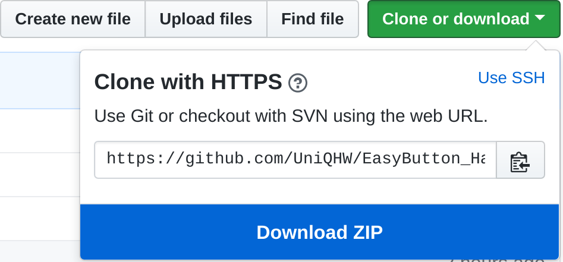
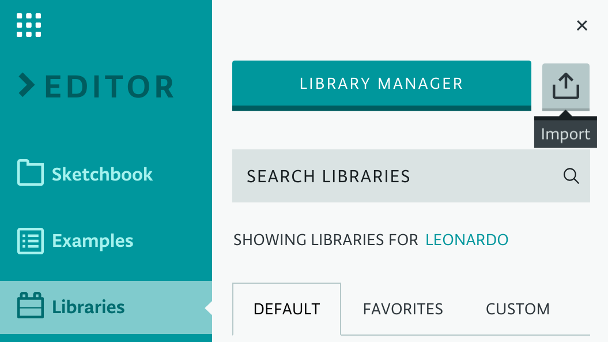

# Easy Button Handler
> Part of my [Easy Button Project]()

An handler interface class for projects involving my modified [Staples Easy Button](https://github.com/UniQHW/EasyButton_Docs.git).

## Contents

- [Installation](#installation)
- [Library Overview](#library-overview)

### `class EasyButton`
  - [EasyButton](#easybutton)
    - [Constructor](#constructor)
    - [Members](#members)
    - [Member Functions](#member-functions)
      - [bool activated()](#bool-activated)
    - [Example](#example)

### `class IEasyButtonHandler`
- [IEasyButtonHandler](#ieasybuttonhandler)
  - [Constructor](#constructor)
  - [Members](#members)
  - [Member Functions](#member-functions)
    - [void init()](#void-init)
    - [void handle()](#void-handle)
  - [Events](#events)
  - **[Implementation Example](#example)**

## Installation

Download the repository as a zip


After obtaining a local copy of the library, import the library in the [Arduino IDE](https://create.arduino.cc/):



### Library Overview
This library provides a total of 2 classes:

|Class|Defined in|Description|
|-----|----------|-----------|
|EasyButton|[EasyButton.h](EasyButton.h)|A primitive hardware abstraction for my modified easy button|
|IEasyButtonHandler|[IEasyButtonHandler.h](IEasyButtonHandler.h)|A handler interface for [EasyButton](#EasyButton) objects|

#### EasyButton
A primitive hardware abstraction for my modified easy button.

#### Constructor
The constructor defines the `pin` member which is used to read the buttons state. In addition, it sets the pin mode to `INPUT`.

**Parameters**:

|Parameter|Description|
|---------|-----------|
|`uint8_t _pin`|Sets the pin that is used to read the buttons state|

#### Members

|Member       |Access |Description                                        |
|-------------|-------|---------------------------------------------------|
|`uint8_t pin`|Private|Defines the pin that is used to receive button data|

#### Member Functions

##### `bool activated()`
> Access: Public

Returns `true` if button is *activated*.

Any of the following actions make up for an *activated* state:

- The Button is pressed
- The Button is held
- The Button plays back audio

##### Example
The following example keeps the built-in LED on when the button is activated.  

```cpp
#include <EasyButton.h>

void setup() {
  pinMode(LED_BUILTIN, OUTPUT);
}

void loop() {
  EasyButton eb(3); // Data cable is connected to pin 3

  /* LED HIGH */
  if(eb.activated()) {
    digitalWrite(LED_BUILTIN, HIGH);
  }

  /* LED LOW */
  else {
    digitalWrite(LED_BUILTIN, LOW);
  }
}

```

#### IEasyButtonHandler
A handler interface for [EasyButton](#EasyButton) objects.

#### Constructor
The constructor is provided with a pointer to the EasyButton object that will be handled by the handler.

**Parameters**:

|Parameter|Description|
|---------|-----------|
|`EasyButton *_eb`|Pointer to an EasyButton object that will be handled|

#### Members

|Member          |Access |Description                                                   |
|----------------|-------|--------------------------------------------------------------|
|`EasyButton *eb`|Private|Points to the EasyButton object that is handled by the handler|

#### Member Functions

##### `void init()`
> Access: Private

Waits for the EasyButton to enter a idle state before proceeding with any other actions.

##### `void handle()`
> Access: Public

This function initiates a **permanent loop**, in which the EasyButton object is constantly polled and handled. Upon handling, certain events can be triggered, based on the actions taken.

**The handle function should be constantly polled in a loop**

#### Events

Handler events are abstract and by default set to return directly after execution. On implementation of the interface, **at least one event should be overwritten.**

|Event|Description|
|-----|------------|
|`virtual void onPush()`|Triggered directly on button push|
|`virtual void onQuickPushed()`|Triggered after a very rapid button push, which doesn't toggle the *"That was easy!"* audio playback.**If this event is triggered, `onComplete()` is ignored**!|
|`virtual void onComplete(unsigned long ms)`|Triggered after the buttons audio playback. The parameter indicates how long the button was held in *ms*, **before** audio playback.|
|`virtual void whileIdle(unsigned long ms)`|Polled while the button is idling. The button is in a idle state when it is _**not activated**_ (See [activated()](#bool-activated)). The parameter indicates how long the button has already maintained a idle state|
|`virtual void whileActivated(unsigned long ms)`|Polled while the button is activated. (See [activated()](#bool-activated)). The parameter indicates how long the button has already maintained a activated state|

#### Example

The following example shows how a very simple implementation of `IEasyButtonHandler` that reports `onPush()`, `onQuickPushed()` and `onComplete()` on the serial bus.

```cpp
#include <IEasyButtonHandler.h>

class MyEasyButtonHandler: public IEasyButtonHandler {

public:

  MyEasyButtonHandler(EasyButton *eb): IEasyButtonHandler(eb) {}

private:

  void onPush() {
    Serial.println("Button pushed!");
  }

  void onQuickPushed() {
    Serial.println("Quick push!");
  }

  void onComplete(unsigned long ms) {
    Serial.println("You've held the button for a total of " + String(ms) + "ms");
  }

  /* We're not going to implement all events */
  // void whileIdle(unsigned long ms) {}
  // void whileActivated(unsinged long ms){}
};

EasyButton *eb = new EasyButton(3); // Data cable is connected to pin 3
MyEasyButtonHandler handler(eb);

void setup() {
  Serial.begin(9600);
}

void loop() {
  handler.handle();
}
```
